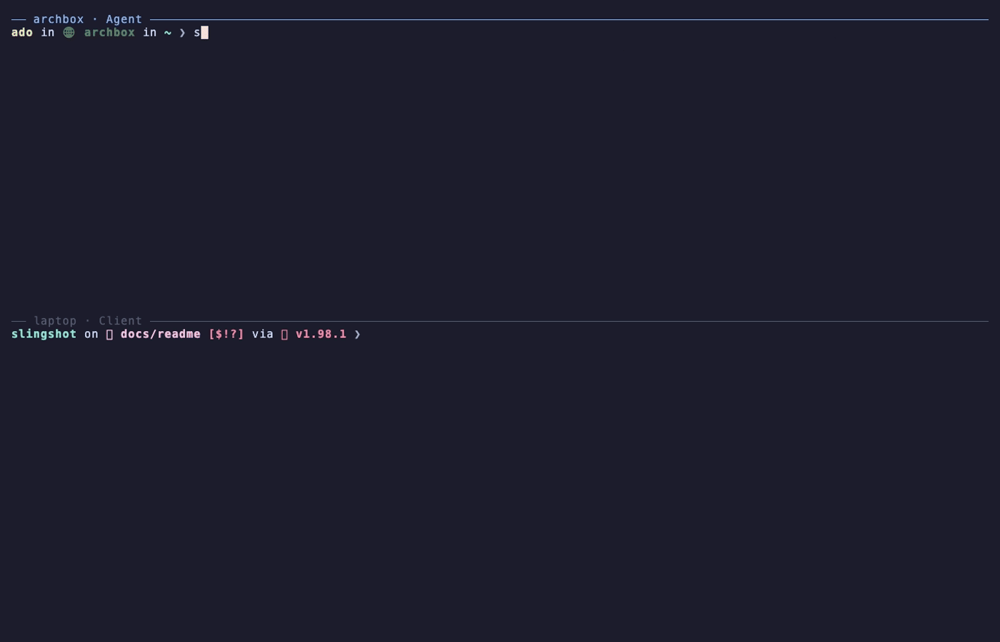
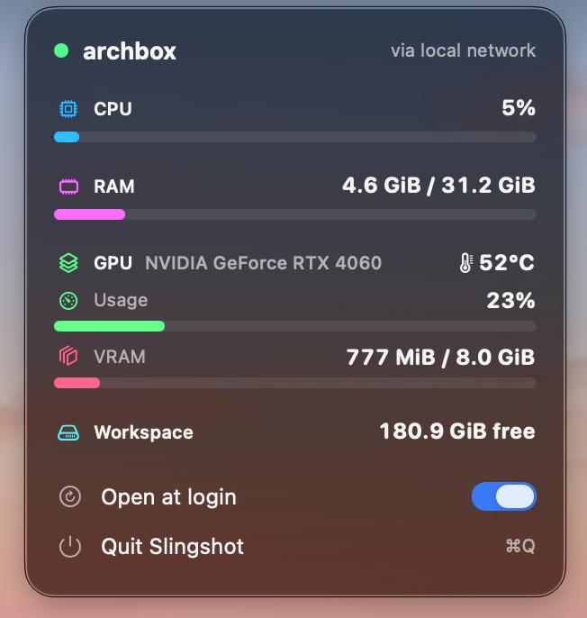

<h1 align="center">Slingshot</h1>

<p align="center">
  <a href="https://github.com/ado11231/slingshot/actions/workflows/ci.yml"></a>
  
  
  <a href="https://github.com/ado11231/slingshot/issues"></a>
</p>

<p align="center">Use the CPU, RAM, and GPU of a powerful machine from your laptop, without leaving your own editor and terminal.</p>

<p align="center"></p>

## What It Does

* Runs builds, servers, containers, and coding agents on a powerful machine, started from your laptop.
* Feels local. Typing, colors, Ctrl C, and exit codes work as they do on your own machine.
* Copies only your source files. Build output such as `target` and `node_modules` stays on the powerful machine.
* Works at home, over a VPN such as Tailscale, or from anywhere, with no account and no router setup.

| Name | Meaning |
| --- | --- |
| **Client** | The machine you work on, such as your laptop. |
| **Agent** | The powerful machine that does the work. |

## Setup

### 1. Install What Slingshot Needs

* **The Agent** needs `git`, `rsync`, `tmux`, Rust, and an ssh server, which lets the Client log in.
* **The Client** needs `git`, `rsync`, and Rust.

| System | Commands |
| --- | --- |
| Arch Linux | `sudo pacman -S --needed git rsync tmux openssh rustup`<br>`rustup default stable`<br>`sudo systemctl enable --now sshd` |
| Ubuntu or Debian | `sudo apt install git rsync tmux openssh-server curl`<br>`curl --proto '=https' --tlsv1.2 -sSf https://sh.rustup.rs \| sh`<br>`sudo systemctl enable --now ssh` |
| Fedora | `sudo dnf install git rsync tmux openssh-server`<br>`curl --proto '=https' --tlsv1.2 -sSf https://sh.rustup.rs \| sh`<br>`sudo systemctl enable --now sshd` |
| macOS | `xcode-select --install`<br>`curl --proto '=https' --tlsv1.2 -sSf https://sh.rustup.rs \| sh` |

* On a Linux Client, skip `tmux` and the ssh server. They are only needed on the Agent.
* A Mac as the Agent also needs `brew install tmux`, and Remote Login turned on in System Settings, then General, then Sharing.

### 2. Install Slingshot

* On both machines:

  ```sh
  git clone https://github.com/ado11231/slingshot.git
  cd slingshot
  cargo install --path crates/slingshot-cli
  ```

* If `slingshot` is then not found, add Rust's folder to your PATH, then open a new terminal. Use `~/.zshrc` instead if your shell is zsh.

  ```sh
  echo 'export PATH="$HOME/.cargo/bin:$PATH"' >> ~/.bashrc
  ```

### 3. Start, Link, And Run

1. On the Agent, start Slingshot. It checks the machine, then prints a pairing code.

   ```sh
   slingshot start
   ```

2. On the Client, run the line it printed. Both machines must be on the same network, or the same VPN, for this step only.

   ```sh
   slingshot link 192.168.1.9:7433:K7QW9ZR2
   ```

3. From a project folder on the Client, run anything on the Agent:

   ```sh
   slingshot run cargo build
   ```

* `link` also offers to install the tools you use, such as Claude Code and Codex, on the Agent. It shows every command and asks first.

## Commands

| Command | Does |
| --- | --- |
| `slingshot start` | Starts Slingshot on the Agent and prints a pairing code. |
| `slingshot link <code>` | Links this machine to an Agent. |
| `slingshot run <command>` | Copies your changes, then runs the command on the Agent. |
| `slingshot attach` | Opens a terminal on the Agent that keeps running when you disconnect. |
| `slingshot sync` | Copies your changes. Add `--pull` to bring the Agent's edits back. |
| `slingshot tools` | Installs tools the Agent is missing, after asking. |
| `slingshot env` | Keeps `.env` files on the Agent, apart from your source. |
| `slingshot ps` | Lists running jobs. |
| `slingshot stop <id>` | Stops a job. |
| `slingshot health` | Shows CPU, RAM, GPU, and disk use. Add `--watch` to keep it live. |
| `slingshot top` | Shows live use with running jobs. |
| `slingshot info` | Shows the Agent's hardware. |
| `slingshot menubar` | Builds and opens the macOS menu bar app. |
| `slingshot unlink` | Removes this machine's access from the Agent. |

* Every option is in [USAGE.md](docs/USAGE.md).

## Menu Bar

<p align="center"></p>

## Status

* Early, and tested between a Mac and an Arch Linux machine.
* What works is in the [roadmap](docs/ROADMAP.md). Planned work is in the [issues](https://github.com/ado11231/slingshot/issues).

<br>

<p align="center">
  <a href="docs/USAGE.md">Usage</a> ·
  <a href="docs/TROUBLESHOOTING.md">Troubleshooting</a> ·
  <a href="docs/ARCHITECTURE.md">Architecture</a> ·
  <a href="docs/ROADMAP.md">Roadmap</a> ·
  <a href="CONTRIBUTING.md">Contributing</a>
</p>
