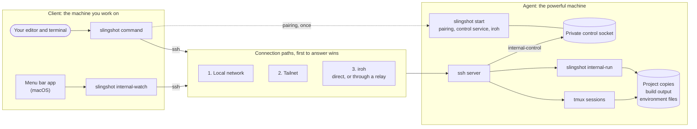
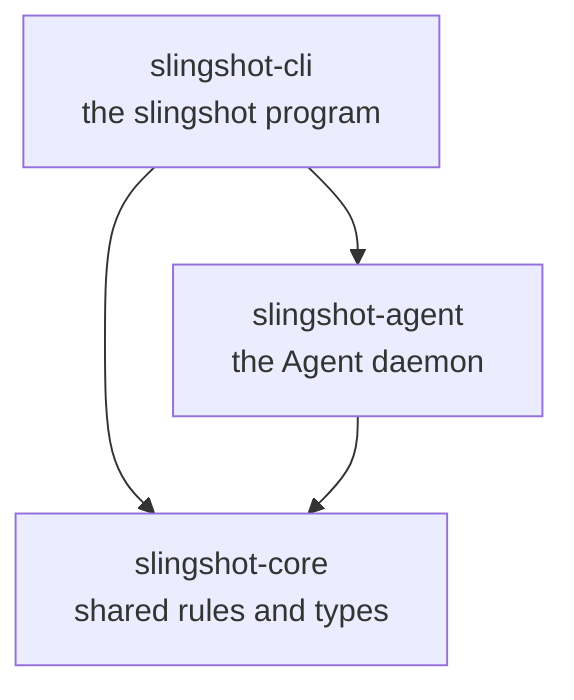
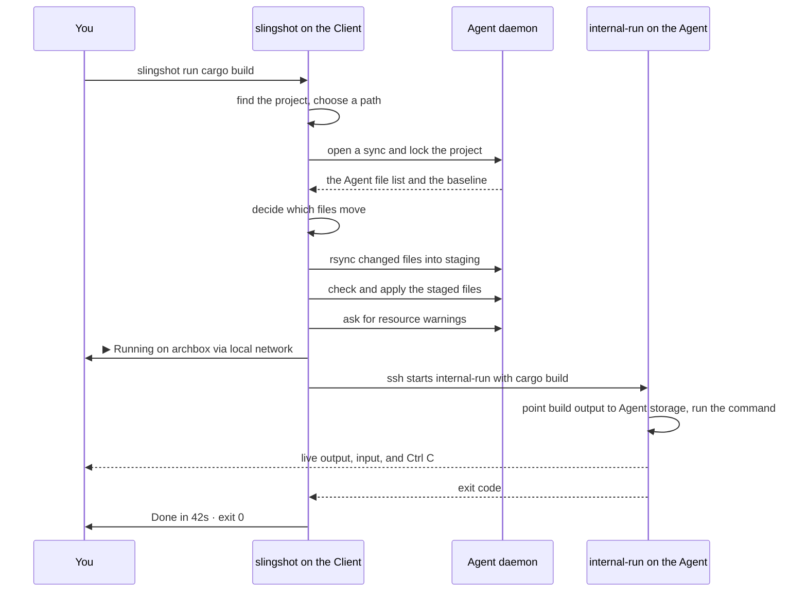
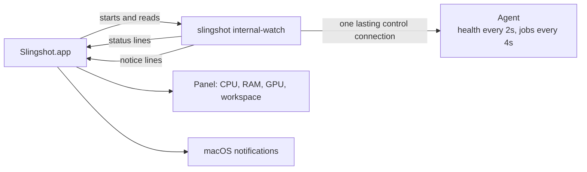

# Architecture

* How Slingshot works inside: its parts, how they communicate, and what every source file does.
* For contributors. To learn the commands, read [USAGE.md](USAGE.md).

## Contents

1. [Overview](#overview)
2. [Key Terms](#key-terms)
3. [The System At A Glance](#the-system-at-a-glance)
4. [How The Code Is Organized](#how-the-code-is-organized)
5. [How The Machines Communicate](#how-the-machines-communicate)
6. [How The Client Reaches The Agent](#how-the-client-reaches-the-agent)
7. [A Command From Start To Finish](#a-command-from-start-to-finish)
8. [Keeping Files In Step](#keeping-files-in-step)
9. [Build Output](#build-output)
10. [Runs And Sessions](#runs-and-sessions)
11. [The Menu Bar App](#the-menu-bar-app)
12. [Security](#security)
13. [Where Data Is Stored](#where-data-is-stored)
14. [File Reference](#file-reference)

## Overview

* Slingshot lets a light machine use the CPU, RAM, and GPU of a powerful one.
* You work in your own editor and terminal. Slingshot copies your project to the powerful machine, runs your commands there, and streams the results back.
* Three principles shape the design:

1. **The machine you work on stays light.** It edits files and shows output, and never does the heavy work.
2. **Slingshot wraps proven tools.** It uses `ssh` for connections, `rsync` for copying, `tmux` for lasting terminals, and the `iroh` library for connections across the internet.
3. **Slingshot always says where work runs.** Every remote command begins with a line such as `▶ Running on archbox via tailnet`.

## Key Terms

| Term | Meaning |
| --- | --- |
| **Client** | The machine you work on. |
| **Agent** | The powerful machine that does the work. Also called the box. |
| **Pairing** | The one time step that lets a Client reach an Agent. |
| **ssh** | The standard tool for logging in to another machine securely. |
| **rsync** | A tool that copies only the files that changed. |
| **tmux** | A tool that keeps a terminal running on the Agent after you disconnect. |
| **iroh** | A library that connects two machines across the internet, even behind home routers. |
| **Tailnet** | A private network between your own machines, made by a VPN such as Tailscale. |
| **Relay** | A public server that passes encrypted traffic between two machines that cannot connect directly. |
| **Source copy** | The Agent's copy of your project, holding only source files. |
| **Baseline** | The last version of the project that both machines agreed on. |
| **Build output** | Files a build creates, such as `target` or `node_modules`. |
| **Job** | One run or one session on the Agent. |
| **Daemon** | A program that runs in the background. Here, the one started by `slingshot start`. |

## The System At A Glance



* Solid arrows are everyday traffic. All of it travels over `ssh`.
* The dotted arrow is pairing, which happens once, on the same network.

## How The Code Is Organized

* The code is a Rust workspace of three crates. A crate is a Rust package.
* Together they build one program, `slingshot`, which acts as the Client or the Agent depending on the command.



| Crate | Role | Contains |
| --- | --- | --- |
| `slingshot-core` | Shared library | Rules both machines must agree on: message formats, settings, which files are source, sync, build output rules, and output style. |
| `slingshot-agent` | Agent library | The daemon: pairing, the control service, project storage, jobs, and the iroh endpoint. |
| `slingshot-cli` | The program | Every command, `ssh` and `rsync` calls, choosing a connection path, and the menu bar helper. |

* **Dependencies flow one way.**

1. `slingshot-cli` uses both libraries.
2. `slingshot-agent` uses `slingshot-core`.
3. `slingshot-core` uses neither.

* A rule both machines need always lives in `slingshot-core`.
* The Rust compiler rejects circular dependencies, so this structure cannot erode by accident.

## How The Machines Communicate

* The machines exchange four kinds of traffic.
* Only pairing has its own port. Everything else travels over `ssh`, so it is encrypted and every caller is checked.

| Traffic | How It Travels | Purpose |
| --- | --- | --- |
| **Pairing** | JSON messages over TCP port 7433 | Exchanges a one time code for access. |
| **Control** | `ssh` starts `slingshot internal-control` | Short requests: health, jobs, sync plans, sessions, environment files, installed tools. |
| **Work** | `ssh` starts `slingshot internal-run`, or joins `tmux` | Runs your command with a real terminal. |
| **Files** | `rsync`, connecting through `slingshot internal-rsh` | Copies changed source files either way. |

* Commands that start with `internal-` are hidden helpers. Slingshot starts them itself.

### Pairing

1. On the Agent, `slingshot start` prints a code such as `192.168.1.9:7433:K7QW9ZR2`: the address, the port, and a secret.
2. On the Client, `slingshot link <code>` connects to that port. Both sides turn the secret into a shared key with SPAKE2, a method that never sends the secret itself.
3. The Client sends its public ssh key and iroh identity, with a proof made from the shared key.
4. The Agent checks the proof. The code works once, expires after 10 minutes, and is burned after 3 wrong tries.
5. The Agent installs the key under a recognizable name, so it can be removed later.
6. The Agent replies with its ssh identity, addresses, iroh identity, and hardware details, with its own proof.
7. The Client checks that proof, so a machine pretending to be the Agent is caught. It saves the details, and from then on reaches the Agent without asking you anything.

* Someone watching the network learns nothing they can use. A wrong guess only counts if it is sent to the Agent, which allows 3.
* Pressing Enter where `slingshot start` runs replaces the code, for linking another machine or after a code was burned.
* `slingshot unlink` reverses pairing. It removes the key, deletes this Client's environment files, and forgets the Agent.

### Control

* The daemon tracks everything with state: pairing, jobs, health, sync locks, and sessions.
* The Client asks it questions in three steps:

1. The Client runs `ssh <agent> slingshot internal-control`.
2. The helper opens a private socket on the Agent, a connection point only the Agent's user account can use.
3. Requests and replies travel as JSON messages, each with a version number, a size limit, and a time limit.

* `ssh` has already checked the caller, so the Agent's user account is the security boundary.
* Message types live in `slingshot-core/src/control.rs`. Changing their shape must raise `control::VERSION`, so mismatched versions refuse to talk instead of misreading each other.

### Work And Files

* Running commands, joining sessions, and copying files all use the real `ssh` and `rsync` programs.
* Slingshot never invents its own way to run commands or move files.
* You never type an `ssh` command for Slingshot, and never edit `~/.ssh/config`.
* Slingshot builds every `ssh` call itself, with its own key, its own list of known machines, and a shared connection that makes repeated calls fast.

## How The Client Reaches The Agent

* Before each connection, the Client tries every saved address at once and uses the most preferred one that answers.

| Order | Path | Works When |
| --- | --- | --- |
| 1 | Local network | Both machines are on the same network. |
| 2 | Tailnet | Both machines are on the same VPN, such as Tailscale. |
| 3 | iroh | Both machines have internet access, anywhere. |

* A home router blocks connections from outside. iroh gets around this by having both machines reach out at the same moment.
* When a direct connection is not possible, traffic goes through a relay.
* For iroh, `ssh` connects through `slingshot internal-tunnel`, and the Agent passes that traffic only to its own ssh server.
* The traffic is `ssh` from end to end, so a relay only sees encrypted data.

## A Command From Start To Finish

* What happens when you type `slingshot run cargo build` in a project folder:



* If your command fails, Slingshot still reports its exit code faithfully. A failing command is not a Slingshot error.

## Keeping Files In Step

### Which Files Are Copied

* `slingshot-core/src/source.rs` decides which files count as source.
* It follows your `.gitignore`, and always leaves out:

1. Version control folders, such as `.git`.
2. Build output, such as `target` and `node_modules`.
3. Environment files, such as `.env`, which often hold secrets.

* Left out files are never copied, pulled, previewed, or backed up.

### How A Sync Works

1. Each machine lists its source files, with a fingerprint of each file's contents.
2. Each list is compared with the baseline, the last version both machines agreed on.
3. A file changed only on the Client is sent. A file changed only on the Agent is kept.
4. A file changed differently on both machines is a **conflict**. The sync stops, nothing is overwritten, and Slingshot never picks a side.
5. `rsync` copies only the changed files into a staging folder.
6. The receiving side checks every staged file, then applies them all at once. If anything fails, it restores the previous state.

* `slingshot sync --pull` runs the same steps in the other direction.
* `slingshot sync --check` shows the plan without changing anything.
* `slingshot env add` stores environment files on the Agent outside the source copy. Their contents never appear in command arguments.

## Build Output

* Build output is never copied between machines. It is large and changes constantly, and copying it would make Slingshot too slow.
* This is the most important performance rule in the project.
* Slingshot recognizes each kind of project and sends its build output to separate Agent storage:

| Project | Recognized By | What Moves | How |
| --- | --- | --- | --- |
| Rust | `Cargo.toml` | `target` | `CARGO_TARGET_DIR` points to Agent storage. |
| Node | `package.json` | `node_modules` | A link points to Agent storage. |
| Python | `pyproject.toml` or `requirements.txt` | `.venv` and the pip cache | A link, and `PIP_CACHE_DIR`. |

* Recognition lives in `slingshot-core/src/stack.rs`. The rules live in `slingshot-core/src/artifacts.rs`.

## Runs And Sessions

* A **run** comes from `slingshot run`.

1. It lasts only as long as its connection.
2. If the connection drops, the Agent stops it and records it as interrupted.

* A **session** comes from `slingshot attach`.

1. It is a `tmux` session that keeps running after you disconnect.
2. Inside a project, it works in the project copy, reached through a link at `~/Slingshot/<project>` so the prompt stays readable.
3. Outside a project, it works in the Agent's home folder and copies nothing.
4. Each project has one session, and the home folder has one.

* An open session does not block syncing or runs. It is a place to work, like a terminal on the Client. A run does block other syncs and runs, because it owns the project copy while it works.
* Sessions use Slingshot's own `tmux` server and settings, so a personal `tmux` setup is never touched:

1. The account's login shell, read from the user database, so startup files and tools load.
2. A full color terminal type and a `UTF-8` locale.
3. Mouse scrolling, a short Escape delay, and a quiet bar showing the Agent and the project.

* The Agent keeps a record of every job.
* `slingshot stop <id>` asks a job to finish, then forces it after five seconds.
* Before stopping a process, the Agent checks its ID and its start time, so it never stops an unrelated program that reused an old ID.

## The Menu Bar App

* A small SwiftUI app in `mac/menubar/` shows the Agent's live status and sends notifications on macOS.
* The app only displays information. Every decision is made in Rust.



* `slingshot internal-watch` asks the Agent for health and jobs, and prints one JSON object per line:

1. A **status** line carries each value and a level: good, warning, or high.
2. A **notice** line is a notification that is due, already written in plain words.

* Thresholds, notification rules, and wording all live in `crates/slingshot-cli/src/watch/`.
* The line format has its own version, `watch::event::VERSION`. The app refuses versions it does not understand.
* The Try again button writes `retry` to the helper, which reconnects at once.
* The app's Swift source is built into the `slingshot` program. `slingshot menubar` writes it to Slingshot's data folder, builds it with Swift, signs it for this machine, and installs it in `~/Applications`.
* The installed app holds a fingerprint of the source it was built from, so `slingshot menubar` rebuilds only when that source changed.
* `slingshot menubar` also saves the location of the `slingshot` program for the app, because apps started at login cannot find it on their own.

## Security

* Pairing codes never cross the network. They work once, expire after 10 minutes, and are burned after 3 wrong tries.
* Both sides prove they know the code, so a machine pretending to be the Agent is refused.
* The daemon listens only on the machine itself and the local network.
* The installed ssh key has a recognizable name, so `slingshot unlink` can remove it.
* Arguments sent to the Agent are quoted one by one, and never joined into a single shell command.
* Control messages carry a version, a size limit, and a time limit.
* The Agent's user account is the security boundary.
* The Agent accepts iroh connections only from paired Clients, and passes them only to its own ssh server.
* Environment file contents never appear in command arguments.

## Where Data Is Stored

* Slingshot uses each system's standard folders, found with the `directories` crate. No paths are fixed in the code.

### On The Client

| What | Where |
| --- | --- |
| Saved Agents | `config.toml` in Slingshot's config folder |
| Agent ssh identities | `known_hosts` in Slingshot's config folder |
| Slingshot's ssh key | `~/.ssh`, under a Slingshot name |
| iroh identity | `client/` in Slingshot's data folder |

### On The Agent

* Inside Slingshot's data folder:

```
jobs/                  one record per run or session
projects/<project id>/
├── source/            the source copy
├── artifacts/         build output such as target, node_modules, and .venv
├── environment/       environment files added with slingshot env
└── state/             the baseline, staging, and backups
```

## File Reference

* Every source file, its purpose, which Slingshot files it uses, and which use it.
* Outside libraries are not listed.

```
slingshot/
├── .github/workflows/ci.yml   runs the checks on every push to master and every pull request
├── Cargo.toml                 the workspace and shared dependency versions
├── crates/
│   ├── slingshot-core/        shared rules and types
│   ├── slingshot-agent/       the Agent daemon
│   └── slingshot-cli/         the slingshot program
├── mac/menubar/               the macOS menu bar app
└── docs/                      architecture, usage, troubleshooting, and roadmap
```

### `slingshot-core`

* Shared by both machines. Depends on neither of the other crates.

| File | Purpose | Uses | Used By |
| --- | --- | --- | --- |
| `lib.rs` | Lists the modules. | none | the other crates |
| `protocol.rs` | Pairing messages and the SPAKE2 handshake, hardware details, and health values. | none | `config`, `control`, `telemetry`, Agent `lib`, several Client commands |
| `control.rs` | Versioned control messages, job records, and message reading and writing. | `protocol`, `source`, `tools` | Agent `service`, `jobs`, `projects`, `runner`; Client `client`, `transfer`, most commands |
| `config.rs` | The Client's saved Agents: loading, saving, and choosing one. | `network`, `protocol` | `keys` and nearly every Client file |
| `network.rs` | Tells local, tailnet, and other addresses apart. | none | `config`, Agent `lib`, Client `route` |
| `tunnel.rs` | What both machines share for iroh: the connection name and a saved identity. | `storage` | Agent `lib`, `clients`, `tunnel`; Client `route`, `tunnel`, `link` |
| `keys.rs` | Names the installed ssh key and reads this machine's ssh identity. | `config`, `storage` | Agent `lib`; Client `keys`, `link`, `unlink`, `transfer` |
| `storage.rs` | Private folders, IDs, safe file writes, and file locks. | none | `source`, `sync`, `keys`, `tunnel`, and many files in both other crates |
| `source.rs` | Decides which files are source, and fingerprints them. | `storage` | `control`, `sync`, Agent `projects`, Client `transfer`, `env`, `menubar` |
| `sync.rs` | Three way sync: planning, conflicts, staging, and safe apply with rollback. | `source`, `storage` | Agent `projects`, Client `transfer` |
| `stack.rs` | Recognizes Rust, Node, and Python projects. | none | `artifacts`, `tools` |
| `artifacts.rs` | Where each kind of project keeps its build output on the Agent. | `stack` | Agent `projects`, Client `run` |
| `telemetry.rs` | Reads hardware details and live use with `sysinfo` and `nvidia-smi`. | `presentation`, `protocol` | `preflight`, `tools`, Agent `lib`, Client `health`, `transfer`, `watch` |
| `preflight.rs` | Setup checks that print the command to fix a problem, and the package manager's install command. | `presentation`, `telemetry` | `tools`, Agent `lib`, `jobs`, `service`; Client `link`, `transfer` |
| `tools.rs` | The developer tools Slingshot can set up on the Agent, how to find them, and the commands that install them. | `preflight`, `stack`, `telemetry` | `control`, Agent `service`, Client `tools` |
| `presentation.rs` | The shared output style: symbols, colors, rows, and sizes. | none | `step`, `preflight`, `telemetry`, every command |
| `step.rs` | A spinner for slow work, then a finished line with the time taken. | `presentation` | Agent `lib`; Client `client`, `transfer`, `run`, `link`, `ps`, `unlink` |

### `slingshot-agent`

* The daemon started by `slingshot start`. Depends only on `slingshot-core`.

| File | Purpose | Uses | Used By |
| --- | --- | --- | --- |
| `lib.rs` | `slingshot start`: setup checks, pairing, and starting the other parts. | `awake`, `clients`, `service`, `tunnel` | Client `main` |
| `service.rs` | The private control socket, the `internal-control` helper that reaches it, and the tools probe run in the login shell. | `clients`, `jobs`, `projects` | `lib`, `runner`, Client `main` |
| `projects.rs` | Project storage: source copies, sync locks, build output, and environment files. | `jobs` | `service`, `jobs`, `runner` |
| `jobs.rs` | Job records, `tmux` sessions, and safe stopping. | `projects` | `service`, `projects`, `runner` |
| `runner.rs` | `slingshot internal-run`: runs one command in the project copy with a real terminal. | `jobs`, `projects`, `service` | Client `main` |
| `clients.rs` | The Clients allowed to connect over iroh. | none | `lib`, `service`, `tunnel` |
| `tunnel.rs` | The iroh endpoint, which passes paired Clients to the local ssh server. | `clients` | `lib` |
| `awake.rs` | Keeps the Agent awake while `slingshot start` runs. | none | `lib` |

* `projects.rs` and `jobs.rs` use each other: a sync must know if a job is running, and a job must know where its project lives.

### `slingshot-cli`

* The `slingshot` program. Depends on both other crates.

| File | Purpose | Uses | Used By |
| --- | --- | --- | --- |
| `main.rs` | Reads the command line with `clap`, calls the matching command, and defines the hidden `internal-` helpers. | every command; Agent `lib`, `runner`, `service` | none, it is the entry point |
| `client.rs` | The pairing connection, and the `Control` connection over `ssh`. | `route`, `ssh`, `tunnel` | `transfer`, `watch`, most commands |
| `route.rs` | Chooses the path: local network, tailnet, or iroh. | none | `client`, `ssh`, `transfer`, `watch`, `run`, `attach` |
| `ssh.rs` | Builds every `ssh` call, with safe quoting and a shared connection. | `route`, `tunnel` | `client`, `run`, `attach`, `unlink` |
| `tunnel.rs` | `slingshot internal-tunnel`: the Client's end of an iroh connection. | `project` | `client`, `ssh` |
| `transfer.rs` | Performs a sync: lists files, plans, calls `rsync`, and reports. | `client`, `project`, `route` | `run`, `attach`, `sync` |
| `project.rs` | Finds the current project and its ID on each Agent. | none | `transfer`, `tunnel`, most commands |
| `keys.rs` | Creates Slingshot's own ssh key. | none | `link` |
| `live.rs` | Full screen views that refresh until you press Q or Ctrl C. | none | `health`, `top` |
| `watch/mod.rs` | `slingshot internal-watch`: polls the Agent and prints lines for the menu bar app. | `client`, `route`, `watch/event`, `watch/state` | `main` |
| `watch/event.rs` | The line format, value levels, and plain explanations of failures. | `commands/health` | `watch/mod`, `watch/state` |
| `watch/state.rs` | Decides when a notification is due, and writes its wording. | `commands/health`, `watch/event` | `watch/mod` |

### Commands

* One file per command, in `crates/slingshot-cli/src/commands/`.
* Each is called by `main.rs`. Shared pieces are noted below.

| File | Command | Uses |
| --- | --- | --- |
| `link.rs` | `slingshot link` | `client`, `keys`, `project`, `menubar`, `tools` |
| `tools.rs` | `slingshot tools`, and the tools step at the end of `link` | `client`, `project`, `route`, `ssh`, `run` |
| `unlink.rs` | `slingshot unlink` | `client`, `project`, `ssh` |
| `run.rs` | `slingshot run` | `client`, `project`, `route`, `ssh`, `transfer` |
| `attach.rs` | `slingshot attach` | `client`, `project`, `route`, `ssh`, `transfer`, `run` |
| `sync.rs` | `slingshot sync` | `project`, `transfer` |
| `env.rs` | `slingshot env` | `client`, `project` |
| `ps.rs` | `slingshot ps` and `slingshot stop` | `client` |
| `info.rs` | `slingshot info` | `client` |
| `health.rs` | `slingshot health`, and the health thresholds `watch` shares | `client`, `live` |
| `top.rs` | `slingshot top` | `client`, `live`, `ps`, `health` |
| `menubar.rs` | `slingshot menubar`, which also builds and installs the app | `project` |

### Tests

* Unit tests sit at the bottom of the file they test.
* `crates/slingshot-cli/tests/output.rs` runs the real program to check help text, colors, and errors.

### `mac/menubar`

* The macOS menu bar app. It talks only to `slingshot internal-watch`.

| File | Purpose |
| --- | --- |
| `Package.swift` | The Swift package definition. No outside dependencies. |
| `Info.plist` | The app's identity. Hides the Dock icon. |
| `Sources/App.swift` | The app's starting point and menu bar icon. |
| `Sources/Watcher.swift` | Starts `internal-watch`, reads its lines, restarts it if it stops, and sends `retry`. |
| `Sources/Model.swift` | Reads the JSON lines. Must match `watch/event.rs`. |
| `Sources/PopoverView.swift` | The panel: the four resource sections, the offline screen, and the bottom rows. |
| `Sources/Bars.swift` | The usage bar shared by every section. |
| `Sources/Notifier.swift` | Posts macOS notifications. |
| `Sources/LoginItem.swift` | Starts the app when you log in. |

* `Model.swift` and `watch/event.rs` describe the same format from both sides.
* Change them together, and raise `watch::event::VERSION` when a field changes meaning or is removed.
